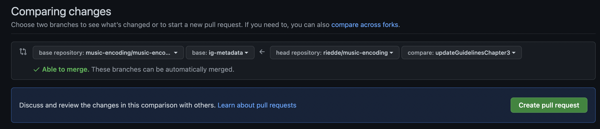

# metadata-ig
The repository of the Metadata Interest Group

## What is it for?
This is a workspace for the metadata IG to store (code) snippets, examples and blocks of text for further development. This is also a place for managing discussions and issues that the IG cares about.

## Who manages this?
The IG sees itself as self-managed. The administrative co-chairs have admin access to this repo, but anyone who is an active member of the IG can request basic administrative rights.

For the metadata IG, an active member is someone who regularly attends IG meetings.

(Of course, the technical team of the MEI community also has admin access.)

## The structure
There is no defined structure for this repository at the moment.
It is recommended to organize the folders thematically.

## How to contribute to the IG
### Workflow (discussions, issues)

Contributions are always welcome! There are several ways to do this:

- Discussions: This should be a sort of 'safe space' for everyone (newbies, old hands, etc.) to say whatever is on their mind: Questions, ideas (which can be very vague), announcements, polls, etc. All you have to do is [open a discussion](https://github.com/music-encoding/metadata-ig/discussions) and you will get feedback from the community. Each time you open a discussion, please choose a category to make it easier to manage.
- Issues: If there is something the IG should work on, or something that should be discussed in an IG meeting (e.g. suggestions for improving the schema), just [open an issue](https://github.com/music-encoding/metadata-ig/issues). Each time you open an issue, please label it to make it easier to manage. Unlike a discussion, an issue is something that needs to be worked on and is understood as a ToDo for the IG.
- Pull Requests: If you would like to contribute to this repository by adding code, please open a [pull request](https://github.com/music-encoding/metadata-ig/pulls).

### Gitflow (IG repository)
- It is not recommended to push directly to the repository. Please always use the [pull request](https://github.com/music-encoding/metadata-ig/pulls) function. This makes it easier to manage the code and improves the documentation. (For example, if release notes are automatically generated, they only document what is accepted).

### Contributing to music-encoding as metadata IG
The workflow to contribute to the schema and guidelines differs from the workflow described above. (see also [https://github.com/orgs/music-encoding/projects/2#card-83741232](https://github.com/orgs/music-encoding/projects/2#card-83741232))

- If you have not already done so, please fork the [music-encoding](https://github.com/music-encoding/music-encoding) repository (using your personal account). 
- Open a new branch (at your fork) for working. Do not use the develop branch! This will complicate updates from the main repo (upstream pulls).
- When someone pushes code on behalf of someone else it is required to clarify this in a comment to the commit message (see [multi author commits](https://docs.github.com/en/pull-requests/committing-changes-to-your-project/creating-and-editing-commits/creating-a-commit-with-multiple-authors)). This means adding a new line after the commit message (one new line for every author). If the content is the result of a discussion in the IG the first co-author is `@music-encoding/ig-metadata`. All other co-authors are named afterwards, each on a new line:
    - Co-authored-by: @music-encoding/ig-metadata
    - Co-authored-by: @username1
    - Co-authored-by: @username2

Reasons: Git documents the creator of a commit regardless of the content author. Further, the creator will appear in GitHub's contributor statistics. By adding co-authors in the way shown above this situation can be counteracted.
 
- If you want to make your code available to the community (for review), you will need to open a [pull request](https://github.com/music-encoding/music-encoding/pulls) in your private fork to the `ig-metadata` branch in the music-encoding repo (see figure below). This will start the process of contributing.

- If code is to be played back on behalf of the IG, an active member previously determined by the IG opens a pull request from `music-encoding/ig-metadata` to `music-encoding/music-encoding`.